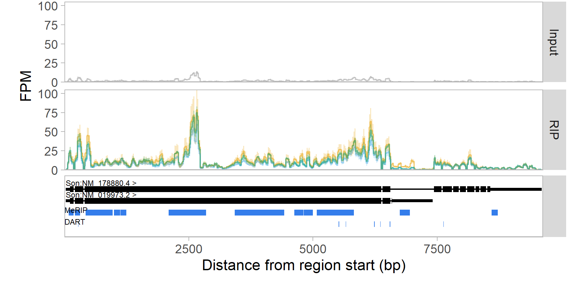

# _wiggleplotr_
_wiggleplotr_ is a tool to visualise RNA-seq read overage overlapping gene annotations. A key feature of _wiggleplotr_ is that it is able rescale all introns of a gene to fixed length, making it easier to see differences in read coverage between neighbouring exons that can otherwise be too far away. Since _wiggleplotr_ takes standard BigWig files as input, it can also be used to visualise read overage from other sequencing-based assays such as ATAC-seq and ChIP-seq. 

This repository contains a modified version of _wiggleplotr_. The original stable version can be installed directly from [Bioconductor](https://bioconductor.org/packages/wiggleplotr/):

## Installation
```r
## try http:// if https:// URLs are not supported
library("devtools")
devtools::install_github("mflamand/wiggleplotr")
```

There are 3 main differences with the original package: 

- Gene structures are displayed in black only (instead of shades of blue), but UTR regions will be slimer than CDS.
- New option in plotCoverage for type = "line_sd", which allows plotting of average+/-standard deviation of coverage as a line + ribbon plot
- Can now optionally inout a list of Granges to be displayed below the gene structure (for example for CLIP sites)





## Getting started
See the [vignette](https://htmlpreview.github.io/?https://github.com/kauralasoo/wiggleplotr/blob/master/vignettes/wiggleplotr.html) for instructions on how to get started.

## Citation
If you use wiggleplotr for research, please cite the Bioconductor package directly: [Alasoo K (2019). wiggleplotr: Make read coverage plots from BigWig files. R package version 1.8.0.](https://doi.org/doi:10.18129/B9.bioc.wiggleplotr)
